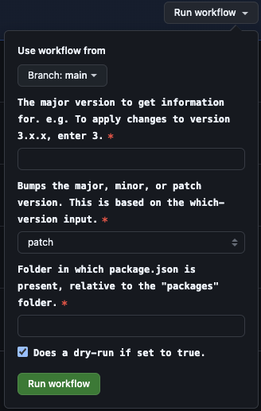

> [!WARNING]
> Manual releases have been deprecated, and will no longer work when using JFrog SaaS. You will need to use the [Semantic Release workflow](./semantic-release.md) instead.

# Manual Package Release

Manual package release is a process that allows you to publish a shared module to artifactory through the Github Actions UI.

- [Manual Package Release](#manual-package-release)
  - [Creating a workflow](#creating-a-workflow)
  - [Publishing a branch](#publishing-a-branch)

## Creating a workflow

Before you can publish a shared module, you will need to have the workflow added to the `.github/workflows` folder in your git repo if it doesn't already exist. This workflow will be used to publish the package to artifactory.

It can be found [here](https://github.com/optum-ecp/turbo-ui-starter/blob/main/.github/workflows/publish-npm-package.yml).

## Publishing a branch

Once your shared module is in a branch on github, you can publish it to artifactory through a manual workflow on Github Actions. This will publish the package to artifactory, and yourself and others can use it in applications.

> [!WARNING]
>
> The workflow must be committed to the default branch on Github (usually `main`) in order for github actions to run the workflow. However, the workflow can be run on any branch you want to publish from.

In the Actions tab of Github, on the left side you will see a tab called "Publish NPM Package". Click on that, and then click the "Run workflow" button. This will open a dropdown where you can select the branch you want to publish from along with 4 additional options:

1. `branch` &ndash; This is the first input which allows you to select the branch you want to publish from. This should be the branch that your shared module is currently on (usually `main` or the default branch).
2. `which-version` &ndash; This is the second input which takes the "major" version number you want this to affect.
3. `bump` &ndash; This is the third input which allows you to select `major`, `minor`, or `patch` to bump the version number for the `which-version` you selected. So, if you want to bump the `minor` version of `1.0.0` to `1.1.0`, you would select `1` for `which-version` and `minor` for `bump`. If you want to bump the `major` version of `1.0.0` to `2.0.0`, you would select `1` for `which-version` and `major` for `bump`.
4. `path` &ndash; This is the fourth input which requires you to set the path for the shared module to release. This path will be appended to `packages`, so you don't need to type `packages` in the path. For example, if you want to release the `example-module`, you would type `ui/example-module`.
5. `dry-run` &ndash; This is the fifth input which allows you to test the workflow without actually publishing the package. Uncheck this box to publish the package to artifactory. Keep it checked to make sure your build is working as expected, as npm will output the package information and files that will be published.

> **Note:** Once the workflow completes, you can view the artifact that was created by the workflow, and you can also view the package in artifactory (if you didn't do a dry-run) to make sure it was published correctly.

