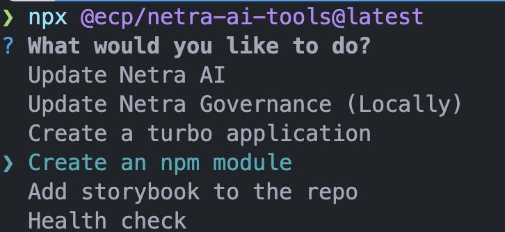

# Shared Modules

Shared modules are modules that are used across the entire application, and published as a separate package to artifactory. These modules shouldn't have nextjs specific code, and should be able to be used in any react application.

- [Shared Modules](#shared-modules)
  - [Netra AI Tools](#netra-ai-tools)
  - [The `example-module`](#the-example-module)
    - [The `package.json`](#the-packagejson)
      - [Name](#name)
      - [Type](#type)
      - [Exports](#exports)
      - [Dependencies/Peer Dependencies](#dependenciespeer-dependencies)
      - [`package.json` example](#packagejson-example)
    - [The `tsconfig.lib.json`](#the-tsconfiglibjson)
  - [Using the shared module](#using-the-shared-module)
    - [Add the shared module to your application](#add-the-shared-module-to-your-application)
    - [Install the shared module](#install-the-shared-module)
    - [Import the shared module](#import-the-shared-module)
  - [Publishing](#publishing)
    - [After Publishing](#after-publishing)

## Netra AI Tools

> [!WARNING]
> This is the recommended way to create a shared module, as it will create the folder structure for you, and install the required dependencies. It will also create the `package.json` and `tsconfig.lib.json` files for you.

Netra AI Tools comes with a builtin command to do all of this for you. Just run the following command:

```bash
npx @uhg-netra-ai/netra-ai-tools@latest
```



When prompted, select the `Create an npm module` option. This will then guide you through the process of creating a shared module. It will ask you for the name of the module, and then create the folder structure for you. It will also create the `package.json` and `tsconfig.lib.json` files for you, and install the required dependencies.

Once complete, you can skip to [Using the shared module](#using-the-shared-module) to add the shared module to your application(s) and/or [Publishing](#publishing) to publish the shared module to artifactory.

## The `example-module`

The `example-module` folder is an example that you can either rename and repurpose, or mimic in your own folder. How you setup your shared module is up to you, as the example has the minimum required to get a shared module working.

### The `package.json`

In the `package.json`, you will need to update the `name`, `exports`, `type`, and `dependencies`/`peerDependencies` at minimum. The `package.json` must not have `private: true` set, as this will prevent it from being published to artifactory, and the `version` should be `1.0.0`.

#### Name

The `name` should be the name of the package you want to publish to artifactory. This is `@uhg-netra-ai/<package-name>`, where `<package-name>` is the name of the shared module. Remember to make sure the package doesn't already exist in artifactory. You can check here [here](https://repo1.uhc.com/ui/packages), or run the command `npm view @uhg-netra-ai/<package-name>` which will return the package information if it exists otherwise it will return a 404 error.

#### Type

The `type` should be set to `module` so that it can be used in a module environment.

#### Exports

The `exports` should be a list of paths to all the entry points of your shared module. This could be one or many and can be configured in multiple ways, so you can read more about [entry points here](https://nodejs.org/api/packages.html#package-entry-points) so they work well with your application.

- **Note 1:** Each exported item is relative to the `package.json` file, so if you have a folder called `src` with a folder called `components` with a file called `button.tsx`, then the path would be `./src/components/button.js`. Note the differences in file extensions, as the `exports` should point to the compiled file, not the source file.
- **Note 2:** The key in the `exports` object is how the module will be imported, so that means that the key doesn't have to match the actual file path but does need to be unique. However, the value does need to match the actual file path.
- **Note 3:** The `value` does support wildcards, so you can use `*` to match any file in a folder, this is useful for exporting all files in a folder so that you don't have to export each file individually. e.g. `"./components/*": "./src/components/*.js".`

#### Dependencies/Peer Dependencies

The `dependencies`/`peerDependencies` should be a list of all the dependencies that your shared module uses. This is not the dependencies of the application, but the dependencies of the shared module. You don't want to include more than you need, but you also don't want to exclude anything that is required.

> **Note:** The `dependencies` are dependencies that your shard module uses that the application probably doesn't use on it's own, but are required by the shared module. The `peerDependencies` are dependencies that you know both the shared module will import and the application will import, e.g. `react` and `react-dom`, or `@uhg-netra-ai/core-component-library` and `@uhg-netra-ai/common-component-library`.

#### `package.json` example

```diff
{
+ "name": "@uhg-netra-ai/example-module",
  "version": "1.0.0",
+ "type": "module",
  "scripts": {
+   "build": "tsc -p ./tsconfig.lib.json"
  },
+ "exports": {
+    "./components/*": "./src/components/*.js",
+    "./other-component": [
+      "./src/other/other-component.ts",
+      "./src/other/other-component.tsx",
+      "./src/other/other-component.js"
+   ]
+ }
  "dependencies": {
    "axios": "^1.7.7",
    "lodash": "^4.17.21"
  },
  "peerDependencies": {
+   "@uhg-netra-ai/core-component-library": "^2.7.0",
+   "@uhg-netra-ai/common-component-library": "^2.7.0",
+   "next": "^16.0.0",
+   "react": "^19.0.0",
+   "react-dom": "^19.0.0"
  }
}
```

### The `tsconfig.lib.json`

In the `tsconfig.lib.json`, you will need to update the `outDir` to be the same path as the current shared module folder only within a `dist` folder within the root of the application. So for example, if your shared module is in `packages/example-module`, then the `outDir` should be `dist/packages/example-module` (this is a relative path to the `tsconfig.lib.json` file).

```diff
{
  "extends": "@repo/typescript-config/base.json",
  "compilerOptions": {
    "composite": true,
+   "outDir": "./dist/example-module"
  },
}
```

It is also recommended to use the `moduleResolution: bundler` with `module: preserve`.

```diff
{
  "extends": "@repo/typescript-config/base.json",
  "compilerOptions": {
    "composite": true,
+   "module": "preserve",
+   "moduleResolution": "bundler"
  },
}
```

## Using the shared module

To use the shared module, you will need to add the shared module to any application(s) that will be using the shared module.

### Add the shared module to your application

Next, for any application that you want to use the shared module in your local whether it be for your app or just for testing, you will need to add the shared module to the `dependencies` in the `package.json` of the application, so that would be in `apps/<your-app>/package.json`.

> **Note:** The semantic versioning should match the version in the shared module's `package.json`, otherwise it may attempt to get it from artifactory instead of the local workspace when installing from the root.

<!-- prettier-ignore -->
```diff
{
  "name": "turbo-example-app",
  "dependencies": {
    "@uhg-netra-ai/core-component-library": "^1.0.0",
    "@uhg-netra-ai/common-component-library": "^1.0.0",
+   "@uhg-netra-ai/example-module": "^1.0.0"
  }
}
```

### Install the shared module

You will now need to run the install command from the root of the application to install the shared module within the application. Since the root is a workspace, it will install the shared module from the local workspace instead of from artifactory.

```bash
npm install
```

### Import the shared module

You can now use the shared module in your application. You can import the shared module like any other module, and use it in your application. So lets assume the `package.json` of the module looks like this:

See [Exports](#exports) for more information on how to configure the exports.

```json
{
  "name": "@uhg-netra-ai/example-module",
  "exports": {
    "./hello-world": "./src/hello-world.js"
  }
}
```

We would then be able to import the `HelloWorld` component into our application like so:

```tsx
import { HelloWorld } from '@uhg-netra-ai/example-module/hello-world';

export default function Home() {
  return <HelloWorld />;
}
```

## Publishing

There are two ways to publish a shared module:

1. Using [Semantic Release](../../docs/npm-releases/semantic-release.md) (Recommended).
   - This will automatically publish the package to artifactory when a PR is merged into a supported branch using a semantic commit message.
2. Using a [manual release](../../docs/npm-releases/manual-release.md).
   - This will allow you to publish the package to artifactory manually using Github Actions through the Github UI.

### After Publishing

After the package is published to artifactory, you can now view it using the same command to check if it exists in artifactory.

```bash
npm view @uhg-netra-ai/<package-name>
```

You can also visit the artifactory page to see the package information and files that were published [here](https://repo1.uhc.com/ui/packages).
